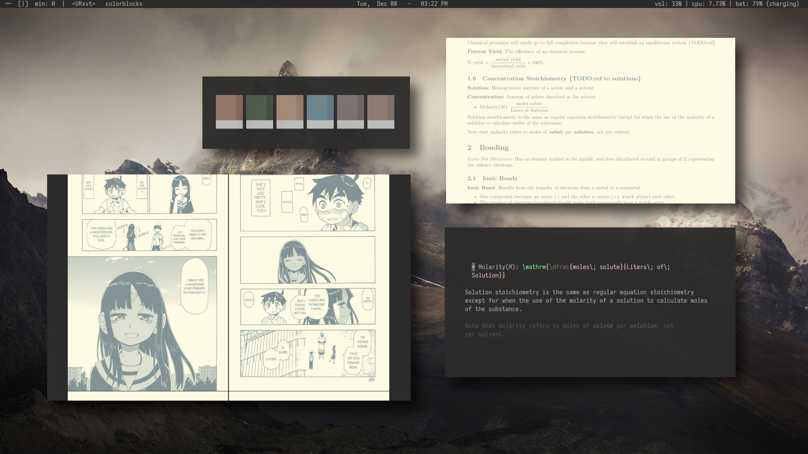

<h1 align="center">~ Dotfiles ~</h1>

This repo contains my personal dotfiles, which I use for study and reading.

## Programs
- Distro: Fedora 33
- WM: spectrwm
- Editor: nvim
- Terminal: urxvt
- Launcher: dmenu and rofi
- Music Player: cmus
- Audio Visualizer: glava
- Notifications: dunst

Many of these files are specific to my system, and will likely not be compatible out of the box. I suggest you take only what you need and modify those if necessary, rather than applying the whole repo to your system right away.
