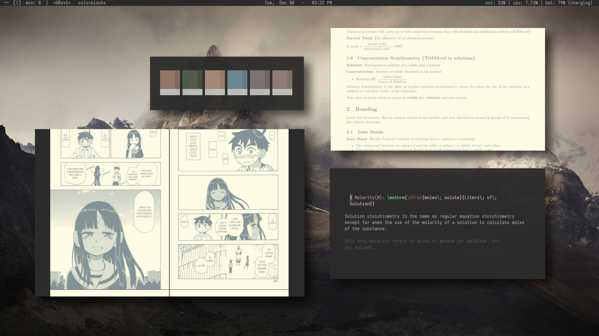
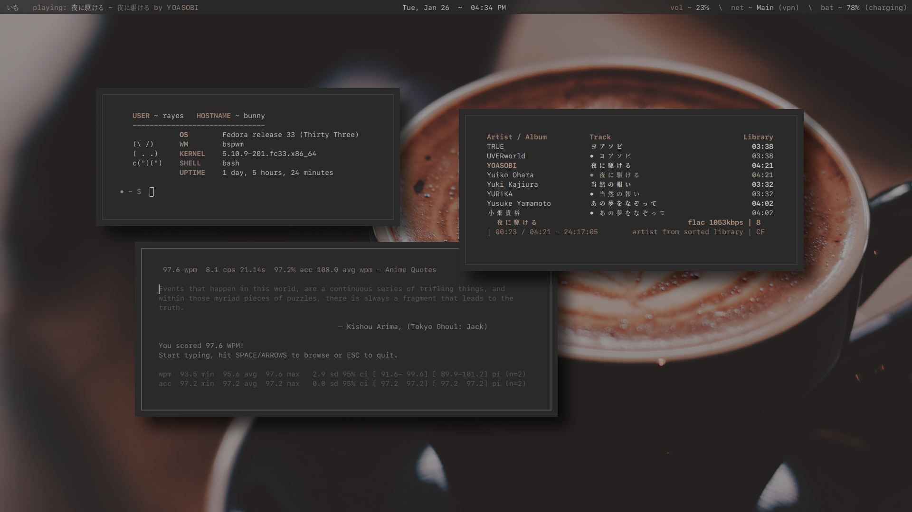

<h1 align="center">~ Dotfiles ~</h1>

This repo contains my personal dotfiles for my own backup purposes. A lot of the files here are specific to my system, and will likely not be compatible with yours right out of the box. I suggest looking at my  for application themes that will be compatible across the majority of systems.

## Info
- Distro: Fedora 33
- Main WM: spectrwm
- Colorscheme: I mainly use , a colorscheme I created
- Editor: nvim
- Terminal: urxvt
- Launcher: dmenu and rofi
- Music Player: cmus
- Audio Visualizer: glava
- Notifications: dunst

## spectrwm: Main Setup

## bspwm

