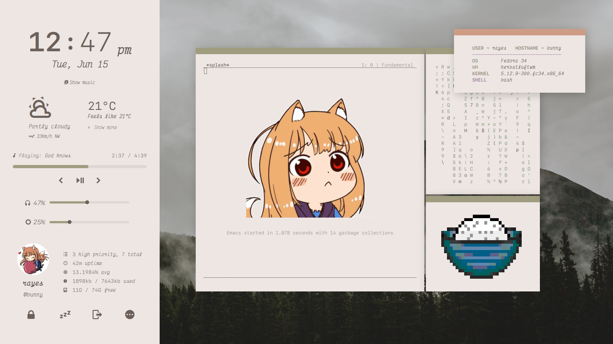

<h1 align="center">Dotfiles</h1>

A backup of my personal dotfiles. Take what you need and make sure to do a quick check through the files before you use it and replace my applications with the ones you use (some files are specific to my system).

Most of the info in this README are copy and pasted sections from some notes I took while setting this up. They are meant as informative notes for myself in the case that I need to reference them later or if I need to recreate portions of my setup on another system. They are probably messy, and I don't know if people other than me will be able to easily follow them. Nonetheless, if you want things to work, make sure to read through everything relevant to you before coming to me for help.

Also take a look at my colorscheme repos ( and ).

## Info
- Distro: Fedora
- Main WM: spectrwm
- Dark theme: 
- Light theme: 
- Bar: spectrwm built in bar when I'm using spectrwm, or lemonbar otherwise
- Editor: nvim
- Terminal: urxvt (patched with true color and double glyphs support)
- Launcher: rofi
- Music Player: cmus
- Audio Visualizer: glava
- Notifications: dunst

### spectrwm: Main Setup

Distraction-free, focused on usability and productivity.


### bspwm


### herbstluftwm



### Bash and Readline Configuration

Relevant files: `.inputrc`

Provides some enhancements for the bash shell (or any input program using readline):

- Switch between emacs and vi mode with `alt-e`. Adaptive prompt shows which mode your in.
- Better tab completion (highlighted completions according to `LS_COLORS`, only one tap of tab needed, case insensitive, skips already completed text, and visible completion stats)
- Better history scrolling, marks changed lines and preserves cursor position
- Some other small things, check the file for more info

May cause errors and unexpected behaviour when used with readline-supporting shells other than bash, I use bash as my primary shell so I haven't tested it.

Some `.bashrc` settings. Mainly notes for myself since I didn't include my actual `.bashrc`:

```sh
# Better cd, allows cool stuff like autocorrection and autocd
shopt -s autocd
shopt -s cdspell

# History
shopt -s histappend
shopt -s histverify

# Use neovim for manpages
export MANPAGER='nvim +Man!'

# Useful aliases
alias la='ls -A'
alias ll='ls -al'
alias ls='ls --color=auto'
alias grep='grep --color=auto'
alias fgrep='fgrep --color=auto'
alias egrep='egrep --color=auto'

# Other useful things
export HISTCONTROL=ignoreboth
```

### Widgets

Implemented though 

##### Previews

Run `eww windows` to get a list of all windows.

Sidebar (music and weather mode):

<p float="left">
	
	
</p>

All credit for weather goes to wttr.in

Calendar:


Each widget also has a dark mode.

##### Info

**Relevant files:**

- Wrapper script: `bin/start-eww` (purpose explained below)
- Everything in the `.config/eww` directory
- `bin/powermenu.sh` (script for powermenu)
  - `.config/rofi/powermenu.rasi` (theme for powermenu)
  - `.config/rofi/confirm.rasi` (confirmation for powermenu)
- `.config/cmus/scripts/cmus-status.sh` (used as the status program in cmus so that eww variables can be updated whenever cmus changes without the need for spamming a shell command every couple seconds)

**What you need for these to work:**

- The above relevant files (obviously) as well as `eww` installed somewhere in your `PATH`
- SF Mono Nerd Font (used for icons and as a main font)
- Victor Mono Font (used for cursive italics)
- `light` () (used to control brightness, has many advantages over xbacklight, such as not relying on X, and saving the value between reboots)
- `pacmd` and `pactl` from the `pulseaudio-utils` package (used to control volume and audio sinks instead of alsamixer mainly for easier handling of multiple sinks, may or may not be installed as a dependency of pulseaudio depending on your distro)
- `ffmpeg` to extract cover art from files
- `cmus` as a music player
  - Other music players will require quite a bit of work to adapt to this setup (look at the wrapper script and the sidebar config if you want to know why)
- `todo.sh`, a script from the . Used for managing the todo list (more info below)
- GNU `date`, not other variants because the calendar widget selects dates using `date -d`.
- `jq` to parse quotes from a json file. Note that I have not checked over all 8600 quotes from the provided quote file, and I make no guarantees towards the quality either. Check the Other Info section if you want to use a custom quote file.

**Steps you need to take:**

These are assuming you have already copied the relevant files listed above to their proper locations.

1. User profile picture: An image file located at `~/.face.png` (note the **png** extension) will be used. Get an image and move it to that location.
2. Modify if needed (check the file to see) `bin/powermenu.sh` to set commands appropriate to your system for locking the screen, powering off, etc.
3. Read and follow the instructions below for todo.sh, cover art and the wrapper script
4. Set up cmus:
  - Type this into the cmus command line: `:set status_display_program=~/.config/cmus/scripts/cmus-status.sh`, which will set the cmus status program required to update eww on song changes. Check through the file and make edits if needed before doing this.
5. Modify the `~/.config/eww/scripts/eww-prefs` file according to the instructions which are commented out in the file. This file is executed by the eww wrapper script and contains some variables that you need to set (namely the command to launch your terminal and location and units for weather info)

To toggle an eww window: `eww close <WINDOW_NAME> || eww open <WINDOW_NAME>`

##### Todo.sh

**Relevant files:** `.config/eww/scripts/check-todo.sh`

I manage my todo list with the  format and the .

**What you need:**
- `todo.sh`, a script from . The script will require some configuration to work. See the documentation on the linked page for how to do this.
- If you use vim/nvim as a text editor and want to use it to edit your todo files, I strongly recommend you install the todo.txt  by dbeniamine. This is not required for the todo widget to work, but it is a good way to do more complex edits on your todo files that would be hard to do with just the todo.txt cli.

After you've configured the todo.txt cli, all the todo widgets should work without further modifications.

To help prioritize tasks, if there are any pending (A) priority tasks, the todo widget will show **only** those. After you have completed all the (A) priority tasks, the widget will show the rest of the tasks.


##### Cover Art

**Relevant files:** `.config/eww/scripts/check-cmus.sh` and `.config/eww/scripts/cmus-info.sh`

- *You should ideally have your music organized into folders *by album* for this to work the best* (the names don't matter though). For example:

```
album_folder
  ├── song1.flac
  ├── song2.mp3
  └── cover.jpg <- this file will be created by the script when a song in this folder is played
another_album
  ├── song1.flac
  ├── song2.mp3
  └── cover.jpg <- same for this one
```

As seen in the example file tree, the script will save album art as a `cover.jpg` file in the parent directory of the song you are currently playing, so it doesn't have to extract it from the song every time.

The script doesn't change your actual music files in any way. It just extracts a cover image. Everything else besides cover art will still work if you don't have this structure, however the widget will display the wrong cover for most of your files.

How cover art is extracted:

1. The script will check the parent folder of the currently playing file for an jpg or png cover file (eg: `cover.jpg`, `front.png`, `folder.jpg`, etc.). If the file exists, it is used as the cover image.
2. If the file doesn't exist, the script tries to extract an embedded image from the metadata tags of the file using ffmpeg. If that works, it will save the image as `cover.jpg` in the parent folder for later use with other songs in the same album. If that fails, no cover art will be shown (a blank transparent box will be shown in it's place).


##### Wrapper script

Relevant files: `bin/start-eww`

Make sure you use this script instead of starting eww by just running `eww daemon`. Most parts of the setup are integrated with this script.

The script will start the eww daemon and control the updating of various eww variables over the course of time that eww is running, mainly through user signals. This prevents the need to spam shell commands every couple seconds/milleseconds, when an eww window is opened and saves a whole bunch of cpu.

To use it, just configure your wm to autorun the script on startup. This will start the eww daemon and watch for signals, as well as update a whole bunch of one-time variables. Here are the signals used by the script, which should cause minimal interference with system signals:

- SIGUSR1 - update volume and brightness
- SIGUSR2 - toggle between weather and music mode for the sidebar
- SIGVTALRM - updates weather information
- SIGURG - update cmus status, song, and album art

If you are unclear on what these mean, read the `signal(7)` manpage.

The script will create a pidfile at `${XDG_RUNTIME_DIR}/eww-wrapper.lock`, so this is the most reliable way to send signals for our usecase:

```
kill -s <signal> $(cat ${XDG_RUNTIME_DIR}/eww-wrapper.lock)
```

This is better than pkill and killall because those two will send the signal to all child processes as well, which is useless for us and takes up quite a bit more time, creating more delay in the update.

As an example, if I had wanted to create a keybind to increase the brightness using the command `light -A 5`, and I wanted to update the variable in eww every time I issue the keybinding, I would do something like this:

```
light -A 5; kill -s USR1 $(cat ${XDG_RUNTIME_DIR}/eww-wrapper.lock)
```

This will change the brightness and then update eww, only when the keybind is pressed, saving the need to check over the value every x seconds while still getting instant updates.

Note that signals can also be sent by directly specifying the signal (eg: `kill -SIGUSR1`) or by using the signal number (eg: `kill -10`), but these are neither rigidly defined nor POSIX compliant.

## Other info

Just some interesting things to note about these setups. You can skip this section if you want.

##### Where are the quotes from?

I scraped them from less-real.com with a script I made ( if you are interested). I have not checked over all 8600 quotes and I make no guarantees to the quality either.

If you want to use a custom quote file, just replace the `.config/eww/quotes.json` file with the json file you want to use. Your json file must follow the format outlined .


##### Why cmus instead of mpd?

- cmus is *really fast*. It starts up instantly even with huge music libraries. Searching and filtering is very quick.
- Very little memory and cpu usage
- More minimal (check the repo sizes)
- Works out of the box with little configuration
- vim-like keybindings and interface with no extra config needed

Note that:
- You can use screen/tmux to detach a cmus session if you want to be able to close the window while still playing music when using cmus (like you can natively in mpd)
- cmus can be controlled remotely much like mpd using cmus-remote. However, if you need playback across multiple clients from one central location, mpd is still the better choice (thats what it's designed for).
- mpd also has a plethora of clients and more features than cmus outside of music playback. Both applications have similar capabilities with regards to playing music though.
  - However, cmus can do most of the things mpd can with scripts and addons

